#linux的shell编程的三大剑客
- grep: 内容查找
- sed: 行操作
- awk: 列操作
## grep 
####1. 定义 
> grep 指令用于查找内容包含指定的范本样式的文件 支持正则表达式
####2. 格式 
> grep [ option ] [ 文件或目录... ]
####3. 常用参数
1. > v 显示不被pattern匹配到的行
    ----
    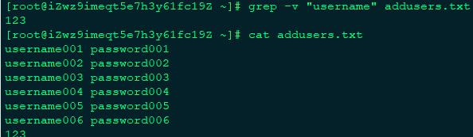
2. > i 忽略字符大小写
    ----
    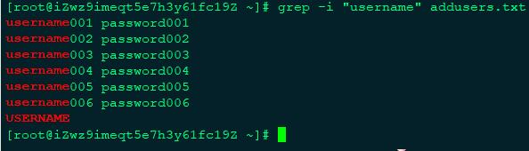
3. > c 统计匹配的行数
    ----
    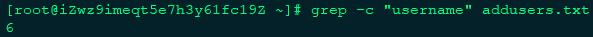
4. > e 实现多个选项间的逻辑or关系
    ----
    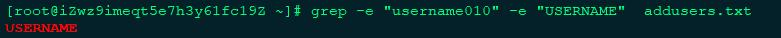
5. > w 匹配整个单词
    ----
    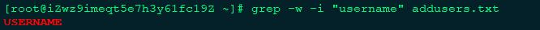
6. > E 使用正则匹配
    ----
    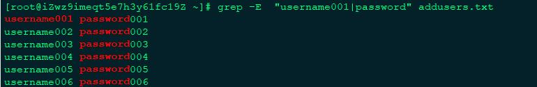
## sed

####1. 定义 
> Stream Editor文本流编辑，sed是一个“非交互式的”面向字符流的编辑器。能同时处理多个文件多行的内容，可以不对原文件改动，
>把整个文件输入到屏幕,可以把只匹配到模式的内容输入到屏幕上。还可以对原文件改动，但是不会再屏幕上返回结果
####2. 格式
> sed [参数] [ action ] [文本文件]
####3. 常用参数
#####参数
1. > -n ：只打印模式匹配的行
    ----
    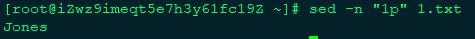    
2. > -e ：直接在命令行模式上进行sed动作编辑，此为默认选项
    ----
    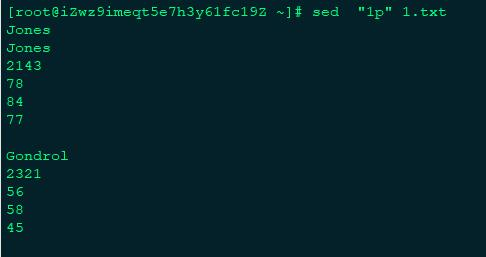
3. > -f ：将sed的动作写在一个文件内，用–f filename 执行filename内的sed动作
    
4. > -r ：支持扩展表达式
    ----
    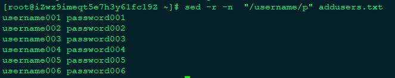
5. > -i ：直接修改文件内容
    ----
    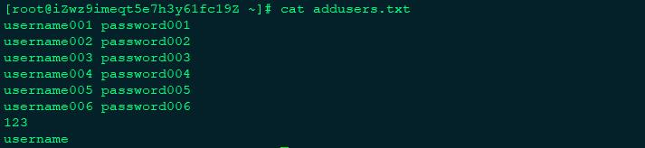
#####action
1. > 新增， a 的后面可以接字串，而这些字串会在新的一行出现(目前的下一行)
2. > 取代， c 的后面可以接字串，这些字串可以取代 n1,n2 之间的行！
3. > 删除， d 因为是删除啊，所以 d 后面通常不接任何咚咚；
4. > 插入， i 的后面可以接字串，而这些字串会在新的一行出现(目前的上一行)；
5. > 打印， p 亦即将某个选择的数据印出。通常 p 会与参数 sed -n 一起运行
6. > 取代， s/// 可以直接进行取代的工作
7. > 行号,  = 为模式空间中的行打印行号
    ---
    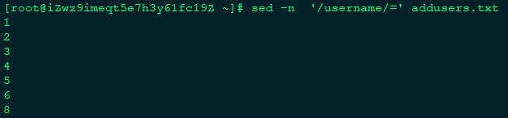
8. > 取反,  ! 模式空间中匹配行取反处理
    ---
    
    ---
    > sed之G、H、g、h 使用
     <https://www.cnblogs.com/fhefh/archive/2011/11/22/2259097.html>
## awk
####1. 定义 
> AWK 是一种处理文本文件的语言，是一个强大的文本分析工具。 
####2. 格式
> awk '{ [pattern]  action }' {filenames} 
####3. 常用参数
1. > -F 指定输入文件折分隔符，fs是一个字符串或者是一个正则表达式，如-F:
        ---
        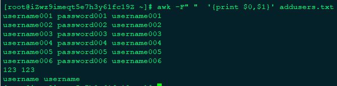
2. > -v var=value 赋值一个用户定义变量。
        ---
        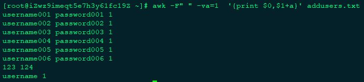
3. >  内建变量
    >> 1. NF 一条记录的字段的数目
    >> 2. NR 已经读出的记录数，就是行号，从1开始
    >> 3. OFS 输出字段分隔符变量
    >> 4. RS 记录分隔符
    >> 5. $0 完整的输入记录

4. > 使用正则，字符串匹配 ~ 表示模式开始。// 中是模式。
   ---
   > 忽略大小写 BEGIN{ignore case=1}
   ---
   > 初始化和操作和收尾 begin{} {} end{ }
   --- ****
---
   > 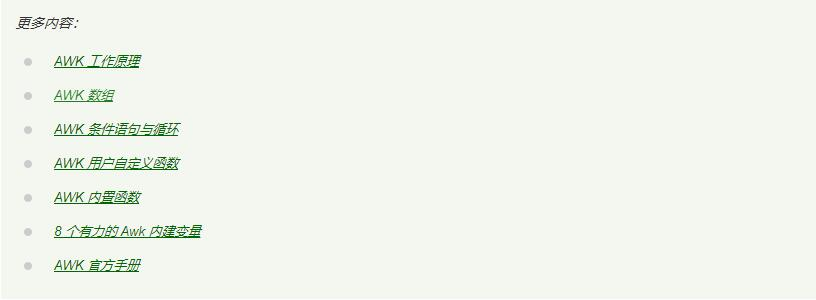